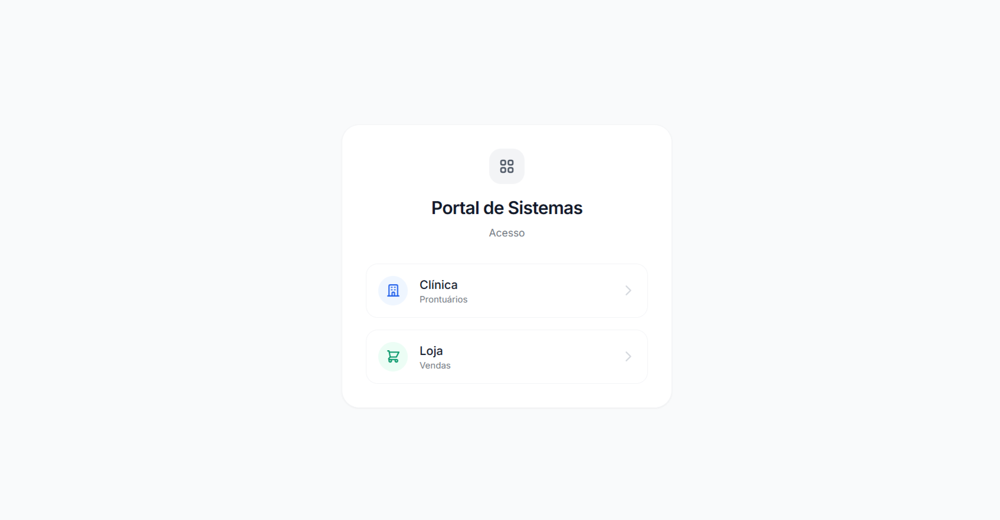
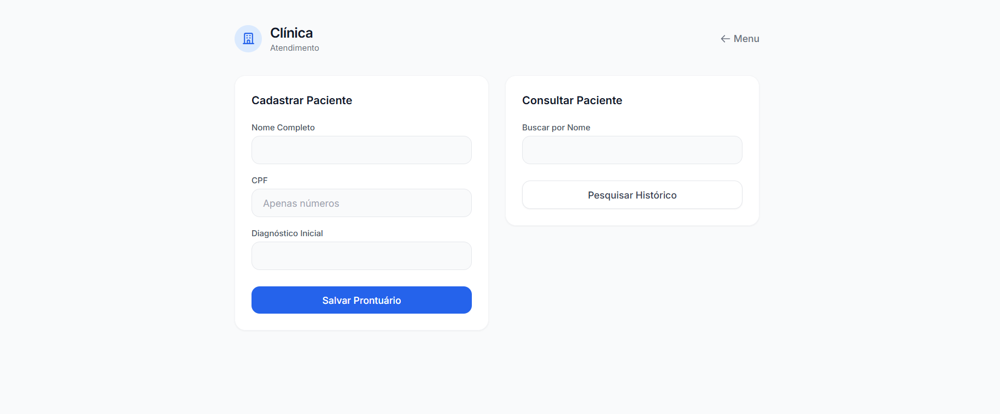
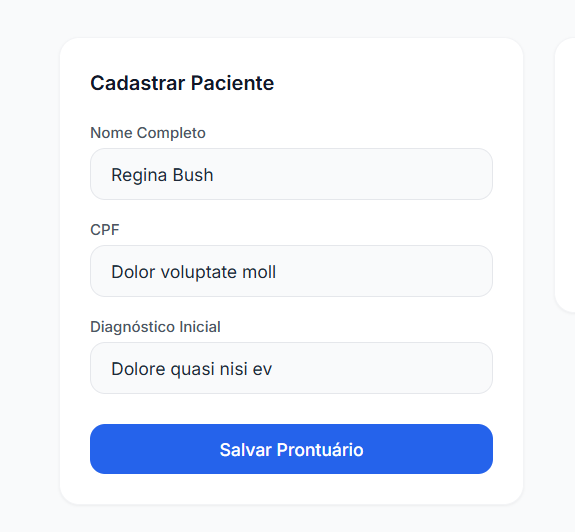
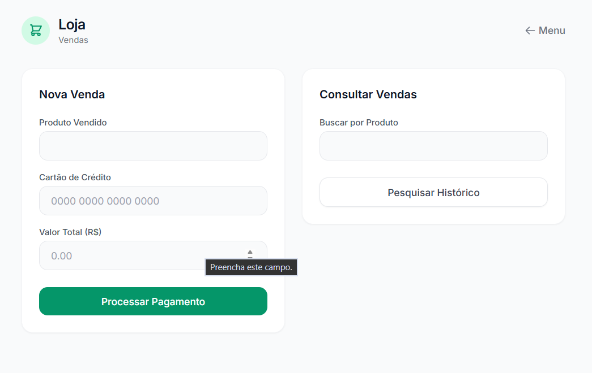

# Testes - Demonstração Web

Este diretório contém uma aplicação completa simuladora, Frontend e Backend Node.js, desenvolvida especificamente para fins acadêmicos, a fim de validar o **Database Security Middleware** operando em tempo real.

Ao utilizar a orquestração configurada neste ambiente, a infraestrutura levanta e configura automaticamente os bancos PostgreSQL isolados, o HashiCorp Vault, o Middleware em duas instâncias, Per-Row e Shared, e a aplicação Cliente.

> [!NOTE]
> Todos os bancos de dados criados aqui estão dentro de containers. O site fará a injeção automática das tabelas assim que for acessado.

## Requisitos
Para execução da infraestrutura virtualizada:
- Docker Engine v24.0+
- Docker Compose v2.20+

## Executando o Teste 

Se você deseja avaliar o funcionamento do Middleware já acoplado ao site:

> [!WARNING]
> **Cuidado com a Pasta de Execução!**
> Certifique-se de que você está dentro deste diretório (`demo/`) para levantar os testes. Se você rodar o docker-compose na raiz do repositório, ele subirá a versão de Produção.

1. Entre no diretório de testes:
   ```bash
   cd demo/
   ```
2. Inicie a orquestração do cluster:
   ```bash
   docker-compose up -d --build
   ```
3. Aguarde cerca de 15 a 20 segundos. Um script rodará internamente na rede Docker para iniciar o HashiCorp Vault, provisionar as master keys e injetar as variáveis.

> [!TIP]
> Caso a interface web retorne erro `ECONNREFUSED`, o Vault ainda está gerando as chaves. Aguarde 10 segundos adicionais.

4. Acesse a interface da aplicação no navegador local:
   `http://localhost:3000`

## Ambiente de Teste

O ambiente de demonstração foi construído para provar a eficácia do middleware. Abaixo está o fluxo de funcionamento:

1. Portal de Acesso
A porta de entrada do laboratório simula uma intranet corporativa que conecta a aplicação aos dois bancos de dados distintos.

<p align="center">
  
</p>

2. Clínica

<p align="center">
  
</p>

3. Busca
Ao buscar por um paciente, a interface exibe a prova real do funcionamento do Middleware: o CPF salvo no banco é um Ciphertext ilegível. Contudo, graças ao mecanismo de Blind Index, a busca parcial pelo nome funciona perfeitamente, filtrando os dados diretamente na memória do proxy.

<p align="center">
  
</p>


4. Modo E-commerce

A aplicação também demonstra a utilização do "Modo Shared" do Middleware voltado para E-commerces, protegendo cartões de crédito com chaves simétricas de alta performance e menor overhead de armazenamento.

<p align="center">
  
</p>
